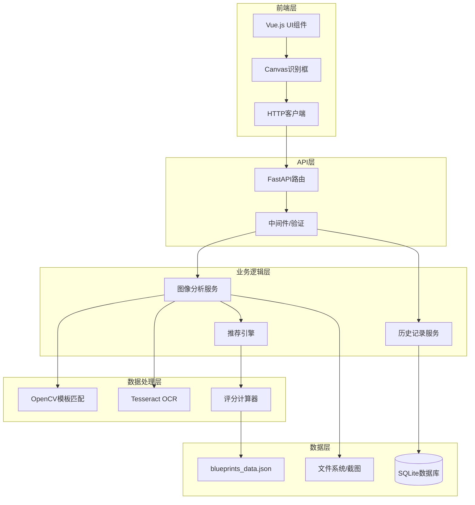

# 设计文档：风暴之城新手蓝图助手

## 概述

风暴之城新手蓝图助手采用前后端分离架构，前端使用Vue.js构建交互界面，后端使用Python FastAPI提供RESTful API服务。系统核心包括图像识别模块（OpenCV + Tesseract）和推荐引擎模块（评分算法）。数据层使用JSON文件存储蓝图静态数据，SQLite存储历史记录。

## 架构

### 系统架构图



### 技术栈

**前端**:
- Vue.js 3.x (组合式API)
- Vite (构建工具)
- Canvas API (识别框绘制)
- Axios (HTTP客户端)
- Element Plus (UI组件库)

**后端**:
- Python 3.10+
- FastAPI (Web框架)
- Pydantic (数据验证)
- OpenCV-Python 4.x (图像处理)
- Pytesseract (OCR)
- SQLAlchemy (ORM)

**数据存储**:
- JSON文件 (蓝图静态数据)
- SQLite (历史记录)
- 本地文件系统 (截图存储)

**部署**:
- Docker + Docker Compose
- Nginx (反向代理)

## 组件和接口

### 1. 前端组件

#### 1.1 UploadComponent (上传组件)

**职责**: 处理截图上传和预览

**接口**:
```typescript
interface UploadComponent {
  // 方法
  handleFileSelect(file: File): void
  validateFile(file: File): boolean
  uploadFile(file: File): Promise<string>
  
  // 事件
  onUploadSuccess(imageUrl: string): void
  onUploadError(error: Error): void
  
  // 属性
  acceptedFormats: string[]  // ['.png', '.jpg', '.jpeg']
  maxFileSize: number        // 10MB
}
```

#### 1.2 RecognitionBoxComponent (识别框组件)

**职责**: 在Canvas上绘制和调整识别区域框

**接口**:
```typescript
interface Box {
  x: number
  y: number
  width: number
  height: number
  label: string  // 'blueprints' | 'resources' | 'species'
}

interface RecognitionBoxComponent {
  // 方法
  initCanvas(imageUrl: string): void
  drawBox(box: Box, color: string): void
  handleMouseDown(event: MouseEvent): void
  handleMouseMove(event: MouseEvent): void
  handleMouseUp(event: MouseEvent): void
  getBoxCoordinates(): Box[]
  
  // 属性
  boxes: Box[]
  selectedBox: Box | null
  isDragging: boolean
}
```

#### 1.3 ResultsComponent (结果展示组件)

**职责**: 显示推荐结果和评分详情

**接口**:
```typescript
interface Recommendation {
  blueprint_name: string
  score: number
  rank: number
  reasoning: string
  details: BlueprintDetails
}

interface ResultsComponent {
  // 方法
  displayRecommendations(recommendations: Recommendation[]): void
  expandDetails(blueprintName: string): void
  getScoreColor(score: number): string
  
  // 属性
  recommendations: Recommendation[]
  expandedBlueprint: string | null
}
```

#### 1.4 HistoryComponent (历史记录组件)

**职责**: 显示和管理历史分析记录

**接口**:
```typescript
interface AnalysisRecord {
  id: string
  timestamp: string
  screenshot_url: string
  game_state: GameState
  recommendations: Recommendation[]
}

interface HistoryComponent {
  // 方法
  fetchHistory(limit: number, offset: number): Promise<AnalysisRecord[]>
  displayRecord(record: AnalysisRecord): void
  deleteRecord(id: string): Promise<void>
  
  // 属性
  records: AnalysisRecord[]
  currentPage: number
  totalRecords: number
}
```

### 2. 后端服务

#### 2.1 ImageAnalysisService (图像分析服务)

**职责**: 协调图像识别流程，提取游戏状态

**接口**:
```python
from typing import Dict, List, Optional
from dataclasses import dataclass

@dataclass
class Box:
    x: int
    y: int
    width: int
    height: int
    label: str

@dataclass
class GameState:
    available_blueprints: List[str]
    resources: Dict[str, int]
    species: str
    confidence: Dict[str, float]

class ImageAnalysisService:
    def __init__(self, template_matcher: TemplateMatcher, ocr_service: OCRService):
        self.template_matcher = template_matcher
        self.ocr_service = ocr_service
    
    def analyze_screenshot(self, image_path: str, boxes: List[Box]) -> GameState:
        """
        分析截图并提取游戏状态
        
        参数:
            image_path: 截图文件路径
            boxes: 识别区域框列表
        
        返回:
            GameState对象，包含识别结果和置信度
        """
        pass
    
    def _extract_blueprints(self, image: np.ndarray, box: Box) -> List[str]:
        """从蓝图区域提取可用蓝图列表"""
        pass
    
    def _extract_resources(self, image: np.ndarray, box: Box) -> Dict[str, int]:
        """从资源区域提取资源库存"""
        pass
    
    def _extract_species(self, image: np.ndarray, box: Box) -> str:
        """从种族区域识别当前种族"""
        pass
```

#### 2.2 TemplateMatcher (模板匹配器)

**职责**: 使用OpenCV进行图标模板匹配

**接口**:
```python
import cv2
import numpy as np
from typing import List, Tuple, Optional

@dataclass
class MatchResult:
    template_name: str
    confidence: float
    location: Tuple[int, int]  # (x, y)

class TemplateMatcher:
    def __init__(self, templates_dir: str):
        self.templates_dir = templates_dir
        self.templates_cache: Dict[str, np.ndarray] = {}
    
    def load_templates(self) -> None:
        """加载所有模板图像到缓存"""
        pass
    
    def match_template(
        self, 
        image: np.ndarray, 
        template_name: str,
        threshold: float = 0.7,
        multi_scale: bool = True
    ) -> Optional[MatchResult]:
        """
        在图像中匹配单个模板
        
        参数:
            image: 输入图像
            template_name: 模板名称
            threshold: 置信度阈值
            multi_scale: 是否使用多尺度匹配
        
        返回:
            匹配结果或None（如果未找到）
        """
        pass
    
    def match_multiple(
        self,
        image: np.ndarray,
        template_names: List[str],
        threshold: float = 0.7
    ) -> List[MatchResult]:
        """在图像中匹配多个模板"""
        pass
    
    def _multi_scale_match(
        self,
        image: np.ndarray,
        template: np.ndarray,
        scales: List[float] = [0.8, 0.9, 1.0, 1.1, 1.2]
    ) -> Tuple[float, Tuple[int, int]]:
        """多尺度模板匹配"""
        pass
```

#### 2.3 OCRService (OCR服务)

**职责**: 使用Tesseract进行文字和数字识别

**接口**:
```python
import pytesseract
from PIL import Image
import cv2
import numpy as np
from typing import Optional

class OCRService:
    def __init__(self, tesseract_cmd: Optional[str] = None):
        if tesseract_cmd:
            pytesseract.pytesseract.tesseract_cmd = tesseract_cmd
    
    def extract_text(
        self,
        image: np.ndarray,
        lang: str = 'chi_sim+eng',
        preprocess: bool = True
    ) -> str:
        """
        从图像中提取文本
        
        参数:
            image: 输入图像
            lang: OCR语言（支持中文简体+英文）
            preprocess: 是否预处理图像
        
        返回:
            识别的文本字符串
        """
        pass
    
    def extract_number(
        self,
        image: np.ndarray,
        preprocess: bool = True
    ) -> Optional[int]:
        """
        从图像中提取数字
        
        参数:
            image: 输入图像
            preprocess: 是否预处理图像
        
        返回:
            识别的数字或None（如果识别失败）
        """
        pass
    
    def _preprocess_image(self, image: np.ndarray) -> np.ndarray:
        """
        预处理图像以提高OCR准确率
        - 灰度化
        - 二值化
        - 降噪
        """
        pass
```

#### 2.4 RecommendationEngine (推荐引擎)

**职责**: 基于游戏状态和蓝图数据计算推荐

**接口**:
```python
from typing import List, Dict
from dataclasses import dataclass

@dataclass
class Blueprint:
    name: str
    type: str
    dlc: str
    inputs: Dict[str, int]
    outputs: Dict[str, int]
    values: Dict[str, int]  # food, fuel, resolve (0-5)
    complexity: int  # 1-5
    synergy: Dict[str, any]  # species_preferences, biome_bonuses

@dataclass
class Recommendation:
    blueprint_name: str
    score: float
    rank: int
    reasoning: str
    details: Blueprint

class RecommendationEngine:
    def __init__(self, blueprints_data: List[Blueprint]):
        self.blueprints_data = blueprints_data
    
    def generate_recommendations(
        self,
        game_state: GameState,
        available_blueprints: List[str],
        top_k: int = 5
    ) -> List[Recommendation]:
        """
        生成蓝图推荐列表
        
        参数:
            game_state: 当前游戏状态
            available_blueprints: 可用蓝图名称列表
            top_k: 返回前k个推荐
        
        返回:
            排序后的推荐列表
        """
        pass
    
    def _calculate_score(
        self,
        blueprint: Blueprint,
        game_state: GameState
    ) -> Tuple[float, str]:
        """
        计算单个蓝图的评分
        
        返回:
            (总分, 评分理由文本)
        """
        pass
    
    def _calculate_base_value_score(self, blueprint: Blueprint) -> float:
        """计算基础价值分: food×10 + fuel×8 + resolve×12"""
        pass
    
    def _calculate_synergy_score(
        self,
        blueprint: Blueprint,
        species: str
    ) -> float:
        """计算种族协同分: 匹配种族偏好+5分"""
        pass
    
    def _calculate_resource_score(
        self,
        blueprint: Blueprint,
        resources: Dict[str, int]
    ) -> float:
        """计算资源充足分: 每个充足资源(≥10)+3分"""
        pass
    
    def _calculate_complexity_penalty(self, blueprint: Blueprint) -> float:
        """计算复杂度惩罚: complexity×4"""
        pass
    
    def _generate_reasoning(
        self,
        blueprint: Blueprint,
        scores: Dict[str, float]
    ) -> str:
        """生成评分理由文本"""
        pass
```

#### 2.5 HistoryService (历史记录服务)

**职责**: 管理分析历史记录的存储和检索

**接口**:
```python
from sqlalchemy.orm import Session
from typing import List, Optional
from datetime import datetime

@dataclass
class AnalysisRecord:
    id: str
    timestamp: datetime
    screenshot_path: str
    game_state: GameState
    recommendations: List[Recommendation]
    user_id: Optional[str]
    session_id: str

class HistoryService:
    def __init__(self, db_session: Session):
        self.db = db_session
    
    def save_record(self, record: AnalysisRecord) -> str:
        """
        保存分析记录
        
        返回:
            记录ID
        """
        pass
    
    def get_records(
        self,
        user_id: Optional[str] = None,
        session_id: Optional[str] = None,
        limit: int = 20,
        offset: int = 0
    ) -> List[AnalysisRecord]:
        """
        获取历史记录列表
        
        参数:
            user_id: 用户ID（可选）
            session_id: 会话ID（可选）
            limit: 返回记录数量
            offset: 偏移量
        
        返回:
            按时间降序排列的记录列表
        """
        pass
    
    def get_record_by_id(self, record_id: str) -> Optional[AnalysisRecord]:
        """根据ID获取单条记录"""
        pass
    
    def delete_record(self, record_id: str) -> bool:
        """删除记录"""
        pass
    
    def cleanup_old_records(self, days: int = 30) -> int:
        """清理指定天数前的记录，返回删除数量"""
        pass
```

### 3. API端点

#### 3.1 POST /api/v1/analyze

**描述**: 上传截图并获取蓝图推荐

**请求**:
```
Content-Type: multipart/form-data

Fields:
- image: File (PNG/JPG/JPEG, max 10MB)
- boxes: JSON string
  [
    {"x": 100, "y": 50, "width": 300, "height": 200, "label": "blueprints"},
    {"x": 450, "y": 50, "width": 200, "height": 150, "label": "resources"},
    {"x": 700, "y": 50, "width": 100, "height": 100, "label": "species"}
  ]
- session_id: string (optional)
```

**响应**:
```json
{
  "request_id": "req_abc123",
  "game_state": {
    "available_blueprints": ["工坊", "农场", "矿场"],
    "resources": {
      "木材": 25,
      "石料": 15,
      "食物": 30
    },
    "species": "人类",
    "confidence": {
      "blueprints": 0.85,
      "resources": 0.92,
      "species": 0.95
    }
  },
  "recommendations": [
    {
      "blueprint_name": "农场",
      "score": 78.0,
      "rank": 1,
      "reasoning": "基础价值分: 56分 (食物4×10 + 燃料2×8 = 56)\n种族协同: +5分 (人类偏好)\n资源充足: +9分 (木材、石料、食物充足)\n复杂度惩罚: -8分 (复杂度2×4)\n总分: 78分",
      "details": {
        "name": "农场",
        "type": "生产建筑",
        "dlc": "基础版",
        "inputs": {"木材": 5, "石料": 3},
        "outputs": {"食物": 10},
        "values": {"food": 4, "fuel": 2, "resolve": 1},
        "complexity": 2,
        "synergy": {
          "species_preferences": ["人类", "精灵"],
          "biome_bonuses": {"平原": 1.2}
        }
      }
    }
  ],
  "record_id": "rec_xyz789"
}
```

**错误响应**:
```json
{
  "request_id": "req_abc123",
  "error": "图像识别失败",
  "detail": "无法识别蓝图区域，请调整识别框位置",
  "status_code": 400
}
```

#### 3.2 GET /api/v1/history

**描述**: 获取历史分析记录

**请求**:
```
GET /api/v1/history?limit=20&offset=0&session_id=sess_123

Query Parameters:
- limit: int (default: 20, max: 100)
- offset: int (default: 0)
- session_id: string (optional)
- user_id: string (optional)
```

**响应**:
```json
{
  "request_id": "req_def456",
  "total": 45,
  "limit": 20,
  "offset": 0,
  "records": [
    {
      "id": "rec_xyz789",
      "timestamp": "2024-01-15T14:30:00Z",
      "screenshot_url": "/uploads/2024-01-15_abc123.png",
      "game_state": { /* ... */ },
      "recommendations": [ /* ... */ ]
    }
  ]
}
```

#### 3.3 GET /api/v1/health

**描述**: 健康检查端点

**响应**:
```json
{
  "status": "healthy",
  "version": "1.0.0",
  "services": {
    "database": "connected",
    "ocr": "available",
    "template_matcher": "loaded"
  },
  "timestamp": "2024-01-15T14:30:00Z"
}
```

## 数据模型

### 1. blueprints_data.json 结构

```json
{
  "blueprints": [
    {
      "name": "农场",
      "name_en": "Farm",
      "type": "生产建筑",
      "dlc": "基础版",
      "inputs": {
        "木材": 5,
        "石料": 3
      },
      "outputs": {
        "食物": 10
      },
      "values": {
        "food": 4,
        "fuel": 2,
        "resolve": 1
      },
      "complexity": 2,
      "synergy": {
        "species_preferences": ["人类", "精灵"],
        "biome_bonuses": {
          "平原": 1.2,
          "森林": 1.1
        }
      },
      "description": "基础食物生产建筑，适合人类和精灵种族"
    }
  ],
  "version": "1.0.0",
  "last_updated": "2024-01-15"
}
```

### 2. SQLite 数据库模式

```sql
-- 分析记录表
CREATE TABLE analysis_records (
    id TEXT PRIMARY KEY,
    timestamp DATETIME NOT NULL,
    screenshot_path TEXT NOT NULL,
    game_state_json TEXT NOT NULL,
    recommendations_json TEXT NOT NULL,
    user_id TEXT,
    session_id TEXT NOT NULL,
    created_at DATETIME DEFAULT CURRENT_TIMESTAMP
);

CREATE INDEX idx_timestamp ON analysis_records(timestamp DESC);
CREATE INDEX idx_user_id ON analysis_records(user_id);
CREATE INDEX idx_session_id ON analysis_records(session_id);

-- 用户表（可选，用于未来扩展）
CREATE TABLE users (
    id TEXT PRIMARY KEY,
    username TEXT UNIQUE,
    created_at DATETIME DEFAULT CURRENT_TIMESTAMP
);
```

## 正确性属性

*属性是一个特征或行为，应该在系统的所有有效执行中保持为真——本质上是关于系统应该做什么的形式化陈述。属性作为人类可读规范和机器可验证正确性保证之间的桥梁。*

### 文件上传与验证

**属性 1：文件验证完整性**
*对于任意*上传的文件，系统应该验证其格式（PNG/JPG/JPEG）和大小（≤10MB），接受有效文件并拒绝无效文件，返回相应的成功或错误响应。
**验证需求：1.1, 1.6**

**属性 2：识别框坐标更新**
*对于任意*识别框拖动或调整操作，系统应该实时更新该框的坐标和尺寸属性，使其反映用户的操作结果。
**验证需求：1.4**

**属性 3：分析请求触发**
*对于任意*确认操作，系统应该将当前截图和所有识别框坐标打包发送到后端API，触发分析流程。
**验证需求：1.5**

### 图像识别

**属性 4：模板匹配通用性**
*对于任意*包含已知模板的图像区域，模板匹配器应该能够识别出对应的图标（蓝图或种族），并返回置信度≥0.7的匹配结果。
**验证需求：2.1, 2.4**

**属性 5：OCR文本提取**
*对于任意*包含清晰文本或数字的图像区域，OCR服务应该能够提取出对应的字符串或数值，或在识别失败时返回null。
**验证需求：2.2, 2.3**

**属性 6：游戏状态结构化**
*对于任意*识别结果，系统应该将其组织为包含available_blueprints、resources、species三个必需字段的GameState JSON对象。
**验证需求：2.5, 2.6**

### 蓝图数据管理

**属性 7：蓝图数据验证**
*对于任意*从blueprints_data.json加载的蓝图，系统应该验证其包含所有必需字段（name、type、dlc、inputs、outputs、values、complexity、synergy），且values中的food/fuel/resolve在0-5范围内，complexity在1-5范围内。
**验证需求：3.2, 3.3, 3.4, 3.5, 3.6**

### 推荐引擎评分

**属性 8：基础价值分计算**
*对于任意*蓝图，其基础价值分应该等于 food×10 + fuel×8 + resolve×12。
**验证需求：4.2**

**属性 9：种族协同加分**
*对于任意*蓝图和游戏状态，如果蓝图的species_preferences列表包含当前种族，则该蓝图应该获得+5分的协同加分。
**验证需求：4.3**

**属性 10：资源充足加分**
*对于任意*蓝图和游戏状态，蓝图应该为其inputs中每个在游戏状态resources中数量≥10的资源获得+3分。
**验证需求：4.4**

**属性 11：复杂度惩罚计算**
*对于任意*蓝图，其复杂度惩罚应该等于 complexity×4，并从总分中扣除。
**验证需求：4.5**

**属性 12：推荐排序正确性**
*对于任意*一组已评分的蓝图，系统应该按评分降序排列，返回前5个（或全部，如果少于5个）作为推荐结果。
**验证需求：4.6, 4.8**

**属性 13：评分理由生成**
*对于任意*推荐的蓝图，系统应该生成包含基础价值分、协同加分、资源加分和复杂度惩罚的reasoning文本。
**验证需求：4.7**

### API接口

**属性 14：分析API响应结构**
*对于任意*成功的/api/v1/analyze请求，响应应该包含request_id、game_state和recommendations字段，且recommendations为数组。
**验证需求：7.3, 7.7**

**属性 15：历史API参数处理**
*对于任意*/api/v1/history请求，系统应该接受可选的limit和offset参数，并根据这些参数返回相应数量和位置的历史记录。
**验证需求：7.5**

**属性 16：API错误响应**
*对于任意*失败的API请求，系统应该返回适当的HTTP状态码（4xx或5xx）和包含error字段的JSON响应。
**验证需求：7.6**

### 历史记录管理

**属性 17：分析记录持久化**
*对于任意*完成的分析，系统应该将包含所有必需字段（id、timestamp、screenshot_path、game_state、recommendations）的AnalysisRecord保存到数据库。
**验证需求：6.1, 6.2**

**属性 18：历史记录排序**
*对于任意*历史记录查询，系统应该按timestamp降序返回记录，最新的记录排在最前面。
**验证需求：6.4**

**属性 19：用户记录隔离**
*对于任意*已登录用户的历史查询，系统应该仅返回该用户的记录；对于未登录用户，应该使用session_id关联和过滤记录。
**验证需求：6.6, 6.7**

### 数据持久化

**属性 20：截图文件保存**
*对于任意*上传的截图，系统应该将其保存到uploads目录，并在数据库中存储格式为"uploads/{timestamp}_{random_id}.{ext}"的相对路径。
**验证需求：9.3, 9.4**

**属性 21：文件清理规则**
*对于任意*清理操作，系统应该删除所有timestamp在30天前的截图文件和对应的数据库记录。
**验证需求：9.6**

### 错误处理

**属性 22：异常捕获和友好错误**
*对于任意*系统异常，系统应该捕获异常并返回用户友好的错误消息，而不是暴露技术细节或导致崩溃。
**验证需求：10.1**

**属性 23：错误日志记录**
*对于任意*错误或异常，系统应该记录包含timestamp、error_type、error_message的日志条目到日志文件。
**验证需求：10.2, 10.3**

**属性 24：数据库重试机制**
*对于任意*数据库连接失败，系统应该重试最多3次，每次间隔2秒，然后才返回最终错误。
**验证需求：10.6**

### 前端交互

**属性 25：推荐结果展示完整性**
*对于任意*返回的推荐，前端应该显示蓝图名称、总评分、排名和reasoning文本，并根据评分使用颜色编码（≥80绿色，50-79黄色，<50灰色）。
**验证需求：5.2, 5.3**

**属性 26：识别框坐标显示**
*对于任意*识别框调整操作，系统应该实时显示该框的当前像素坐标（x, y, width, height）。
**验证需求：12.5**

**属性 27：错误通知显示**
*对于任意*错误事件，系统应该显示Toast通知，包含错误消息，并在3秒后自动消失。
**验证需求：12.7**


## 错误处理

### 1. 前端错误处理

**文件上传错误**:
- 文件格式不支持 → 显示Toast："仅支持PNG、JPG、JPEG格式"
- 文件过大 → 显示Toast："文件大小不能超过10MB"
- 网络错误 → 显示Toast："上传失败，请检查网络连接"

**API调用错误**:
- 超时（>30秒）→ 显示Toast："请求超时，请重试"
- 4xx错误 → 显示服务器返回的错误消息
- 5xx错误 → 显示Toast："服务器错误，请稍后重试"
- 网络断开 → 显示Toast："网络连接已断开"

**识别结果错误**:
- 低置信度警告 → 在结果旁显示警告图标和"识别不确定"提示
- 无可用蓝图 → 显示提示："未识别到可用蓝图，请调整识别框"

### 2. 后端错误处理

**图像处理错误**:
```python
class ImageProcessingError(Exception):
    """图像处理相关错误基类"""
    pass

class TemplateMatchError(ImageProcessingError):
    """模板匹配失败"""
    pass

class OCRError(ImageProcessingError):
    """OCR识别失败"""
    pass

# 错误处理示例
try:
    game_state = image_service.analyze_screenshot(image_path, boxes)
except TemplateMatchError as e:
    logger.error(f"模板匹配失败: {e}", extra={"image_path": image_path})
    return JSONResponse(
        status_code=400,
        content={"error": "图像识别失败", "detail": "无法识别游戏元素，请确保截图清晰"}
    )
except OCRError as e:
    logger.warning(f"OCR识别部分失败: {e}")
    # 继续处理，使用部分识别结果
```

**数据验证错误**:
```python
from pydantic import BaseModel, validator, ValidationError

class AnalyzeRequest(BaseModel):
    boxes: List[Box]
    session_id: Optional[str] = None
    
    @validator('boxes')
    def validate_boxes(cls, v):
        if len(v) != 3:
            raise ValueError("必须提供3个识别框")
        labels = {box.label for box in v}
        required = {'blueprints', 'resources', 'species'}
        if labels != required:
            raise ValueError(f"识别框标签必须包含: {required}")
        return v

# 使用
try:
    request = AnalyzeRequest(**request_data)
except ValidationError as e:
    return JSONResponse(
        status_code=400,
        content={"error": "请求参数错误", "detail": e.errors()}
    )
```

**数据库错误**:
```python
from sqlalchemy.exc import SQLAlchemyError, OperationalError
import time

def save_with_retry(record: AnalysisRecord, max_retries: int = 3) -> str:
    """带重试的数据库保存"""
    for attempt in range(max_retries):
        try:
            return history_service.save_record(record)
        except OperationalError as e:
            if attempt < max_retries - 1:
                logger.warning(f"数据库连接失败，重试 {attempt + 1}/{max_retries}")
                time.sleep(2)
            else:
                logger.error(f"数据库保存失败，已重试{max_retries}次: {e}")
                raise
        except SQLAlchemyError as e:
            logger.error(f"数据库错误: {e}")
            raise
```

### 3. 日志策略

**日志级别使用**:
- DEBUG: 详细的调试信息（模板匹配坐标、OCR原始输出）
- INFO: 一般操作信息（分析请求、推荐生成）
- WARNING: 警告信息（低置信度识别、部分失败）
- ERROR: 错误信息（识别失败、数据库错误）

**日志格式**:
```python
import logging
from logging.handlers import TimedRotatingFileHandler

# 配置日志
logger = logging.getLogger("stormgate_assistant")
logger.setLevel(logging.INFO)

# 文件处理器（按日期轮转）
file_handler = TimedRotatingFileHandler(
    "logs/app.log",
    when="midnight",
    interval=1,
    backupCount=7
)
file_handler.setFormatter(logging.Formatter(
    '%(asctime)s - %(name)s - %(levelname)s - %(message)s'
))

logger.addHandler(file_handler)

# 使用示例
logger.info("分析请求", extra={
    "request_id": "req_123",
    "session_id": "sess_456",
    "boxes_count": 3
})

logger.error("模板匹配失败", extra={
    "template": "farm_icon",
    "confidence": 0.45,
    "threshold": 0.7
}, exc_info=True)
```

## 测试策略

### 1. 单元测试

**目标**: 验证单个组件和函数的正确性

**工具**: pytest (Python), Vitest (TypeScript/JavaScript)

**覆盖范围**:
- 评分计算函数（基础价值、协同、资源、复杂度）
- 数据验证逻辑（蓝图数据、请求参数）
- 工具函数（文件路径生成、日期格式化）
- 错误处理逻辑

**示例**:
```python
# tests/test_recommendation_engine.py
import pytest
from app.services.recommendation_engine import RecommendationEngine

def test_base_value_score_calculation():
    """测试基础价值分计算"""
    blueprint = Blueprint(
        name="测试蓝图",
        values={"food": 4, "fuel": 2, "resolve": 1}
    )
    engine = RecommendationEngine([])
    score = engine._calculate_base_value_score(blueprint)
    assert score == 4*10 + 2*8 + 1*12  # 40 + 16 + 12 = 68

def test_synergy_score_with_matching_species():
    """测试种族协同加分 - 匹配情况"""
    blueprint = Blueprint(
        name="测试蓝图",
        synergy={"species_preferences": ["人类", "精灵"]}
    )
    engine = RecommendationEngine([])
    score = engine._calculate_synergy_score(blueprint, "人类")
    assert score == 5

def test_synergy_score_without_matching_species():
    """测试种族协同加分 - 不匹配情况"""
    blueprint = Blueprint(
        name="测试蓝图",
        synergy={"species_preferences": ["精灵"]}
    )
    engine = RecommendationEngine([])
    score = engine._calculate_synergy_score(blueprint, "人类")
    assert score == 0
```

### 2. 属性测试（Property-Based Testing）

**目标**: 验证系统在各种输入下的通用属性

**工具**: Hypothesis (Python), fast-check (TypeScript)

**配置**: 每个属性测试运行最少100次迭代

**标签格式**: 每个测试必须包含注释，引用设计文档中的属性
```python
# Feature: stormgate-blueprint-assistant, Property 8: 基础价值分计算
```

**属性测试示例**:

```python
# tests/property_tests/test_scoring_properties.py
from hypothesis import given, strategies as st
from app.services.recommendation_engine import RecommendationEngine

# Feature: stormgate-blueprint-assistant, Property 8: 基础价值分计算
@given(
    food=st.integers(min_value=0, max_value=5),
    fuel=st.integers(min_value=0, max_value=5),
    resolve=st.integers(min_value=0, max_value=5)
)
def test_property_base_value_calculation(food, fuel, resolve):
    """
    属性8：对于任意蓝图，其基础价值分应该等于 food×10 + fuel×8 + resolve×12
    """
    blueprint = Blueprint(
        name="随机蓝图",
        type="测试",
        dlc="基础版",
        inputs={},
        outputs={},
        values={"food": food, "fuel": fuel, "resolve": resolve},
        complexity=1,
        synergy={}
    )
    engine = RecommendationEngine([])
    score = engine._calculate_base_value_score(blueprint)
    expected = food * 10 + fuel * 8 + resolve * 12
    assert score == expected, f"期望{expected}，实际{score}"

# Feature: stormgate-blueprint-assistant, Property 12: 推荐排序正确性
@given(
    blueprints=st.lists(
        st.builds(
            Blueprint,
            name=st.text(min_size=1, max_size=20),
            values=st.fixed_dictionaries({
                "food": st.integers(0, 5),
                "fuel": st.integers(0, 5),
                "resolve": st.integers(0, 5)
            }),
            complexity=st.integers(1, 5),
            synergy=st.just({})
        ),
        min_size=1,
        max_size=20
    )
)
def test_property_recommendation_sorting(blueprints):
    """
    属性12：对于任意一组已评分的蓝图，系统应该按评分降序排列
    """
    game_state = GameState(
        available_blueprints=[b.name for b in blueprints],
        resources={},
        species="人类",
        confidence={}
    )
    engine = RecommendationEngine(blueprints)
    recommendations = engine.generate_recommendations(
        game_state,
        [b.name for b in blueprints],
        top_k=len(blueprints)
    )
    
    # 验证排序：每个推荐的评分应该 >= 下一个推荐的评分
    for i in range(len(recommendations) - 1):
        assert recommendations[i].score >= recommendations[i+1].score

# Feature: stormgate-blueprint-assistant, Property 6: 游戏状态结构化
@given(
    blueprints=st.lists(st.text(min_size=1), min_size=0, max_size=10),
    resources=st.dictionaries(
        st.text(min_size=1),
        st.integers(min_value=0, max_value=100)
    ),
    species=st.sampled_from(["人类", "精灵", "兽人"])
)
def test_property_game_state_structure(blueprints, resources, species):
    """
    属性6：对于任意识别结果，系统应该将其组织为包含必需字段的GameState对象
    """
    game_state = GameState(
        available_blueprints=blueprints,
        resources=resources,
        species=species,
        confidence={}
    )
    
    # 验证所有必需字段存在
    assert hasattr(game_state, 'available_blueprints')
    assert hasattr(game_state, 'resources')
    assert hasattr(game_state, 'species')
    assert isinstance(game_state.available_blueprints, list)
    assert isinstance(game_state.resources, dict)
    assert isinstance(game_state.species, str)
```

### 3. 集成测试

**目标**: 验证组件间的交互和端到端流程

**工具**: pytest + httpx (API测试), Playwright (前端E2E测试)

**测试场景**:
- 完整的分析流程：上传截图 → 识别 → 推荐 → 保存历史
- API端点集成：请求验证 → 业务逻辑 → 响应格式
- 数据库操作：保存 → 查询 → 更新 → 删除

**示例**:
```python
# tests/integration/test_analyze_endpoint.py
import pytest
from httpx import AsyncClient
from app.main import app

@pytest.mark.asyncio
async def test_analyze_endpoint_success():
    """测试分析端点成功场景"""
    async with AsyncClient(app=app, base_url="http://test") as client:
        # 准备测试数据
        files = {"image": ("test.png", open("tests/fixtures/test_screenshot.png", "rb"), "image/png")}
        data = {
            "boxes": json.dumps([
                {"x": 100, "y": 50, "width": 300, "height": 200, "label": "blueprints"},
                {"x": 450, "y": 50, "width": 200, "height": 150, "label": "resources"},
                {"x": 700, "y": 50, "width": 100, "height": 100, "label": "species"}
            ])
        }
        
        # 发送请求
        response = await client.post("/api/v1/analyze", files=files, data=data)
        
        # 验证响应
        assert response.status_code == 200
        json_data = response.json()
        assert "request_id" in json_data
        assert "game_state" in json_data
        assert "recommendations" in json_data
        assert isinstance(json_data["recommendations"], list)
        assert len(json_data["recommendations"]) <= 5

@pytest.mark.asyncio
async def test_analyze_endpoint_invalid_file():
    """测试分析端点 - 无效文件格式"""
    async with AsyncClient(app=app, base_url="http://test") as client:
        files = {"image": ("test.txt", b"not an image", "text/plain")}
        data = {"boxes": json.dumps([])}
        
        response = await client.post("/api/v1/analyze", files=files, data=data)
        
        assert response.status_code == 400
        json_data = response.json()
        assert "error" in json_data
```

### 4. 测试数据管理

**测试夹具（Fixtures）**:
```python
# tests/conftest.py
import pytest
from app.services.recommendation_engine import RecommendationEngine

@pytest.fixture
def sample_blueprints():
    """示例蓝图数据"""
    return [
        Blueprint(
            name="农场",
            type="生产建筑",
            dlc="基础版",
            inputs={"木材": 5, "石料": 3},
            outputs={"食物": 10},
            values={"food": 4, "fuel": 2, "resolve": 1},
            complexity=2,
            synergy={"species_preferences": ["人类", "精灵"]}
        ),
        Blueprint(
            name="矿场",
            type="生产建筑",
            dlc="基础版",
            inputs={"木材": 8},
            outputs={"石料": 15},
            values={"food": 0, "fuel": 3, "resolve": 2},
            complexity=3,
            synergy={"species_preferences": ["矮人"]}
        )
    ]

@pytest.fixture
def sample_game_state():
    """示例游戏状态"""
    return GameState(
        available_blueprints=["农场", "矿场", "工坊"],
        resources={"木材": 25, "石料": 15, "食物": 30},
        species="人类",
        confidence={"blueprints": 0.85, "resources": 0.92, "species": 0.95}
    )

@pytest.fixture
def recommendation_engine(sample_blueprints):
    """推荐引擎实例"""
    return RecommendationEngine(sample_blueprints)
```

### 5. 测试覆盖率目标

- 单元测试覆盖率：≥80%
- 属性测试：覆盖所有设计文档中的正确性属性
- 集成测试：覆盖所有API端点和主要用户流程
- E2E测试：覆盖关键用户场景（上传、分析、查看历史）

### 6. 持续集成

**CI流程**:
1. 代码检查（linting）：flake8, pylint, ESLint
2. 类型检查：mypy (Python), TypeScript compiler
3. 单元测试：pytest, Vitest
4. 属性测试：Hypothesis, fast-check（每个属性100次迭代）
5. 集成测试：pytest + httpx
6. 覆盖率报告：coverage.py, c8

**测试命令**:
```bash
# Python后端
pytest tests/unit --cov=app --cov-report=html
pytest tests/property_tests --hypothesis-profile=ci  # 100次迭代
pytest tests/integration

# TypeScript前端
npm run test:unit
npm run test:property  # fast-check配置100次迭代
npm run test:e2e
```
